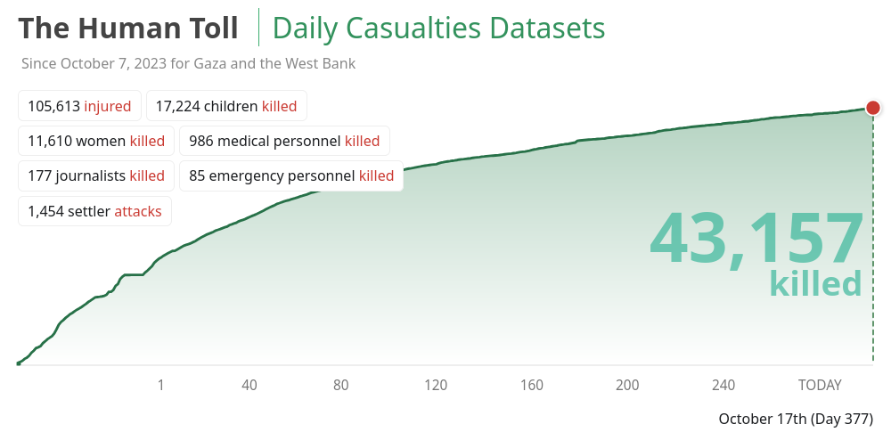
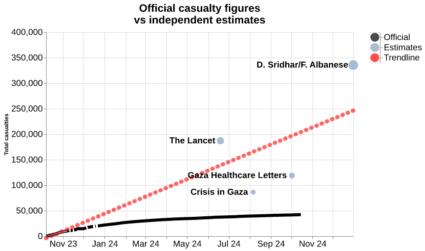

# Estimating the death toll in Gaza

Intro below: full report can be found [in the reports directory](https://github.com/dataactivists/estimating_death_toll_of_war_on_gaza/blob/main/reports/estimating_death_toll_of_war_on_gaza.md).

Since the start of the war on Gaza on Oct 7 2023, the Ministry of Health (MoH) and Government Media Office (GMO) have been producing statistical reports of casualties. As of Oct 17 2024, the official number of casualties stands at 43.157.

The accuracy of this data has been corroborated by independent analyses. However, an increasing number of experts argue it significantly underestimates the true death toll of the war waged by Israel.

In this article, we will attempt to provide an analysis of the MoH methodology, the exacerbating challenges it faces as the war continues, and estimates from independent researchers and humanitarian organisations. Our objective, more than a year into the ongoing genocide, is to advocate for a more accurate picture of the human cost of the war that unfolds in Gaza.

Below is the result of our review of expert estimates. These numbers far exceed official counts, while being based on *conservative estimates* of the true death toll of the Gaza genocide.

According to these conservative estimates, *today we are nearing 200.000 dead.*
